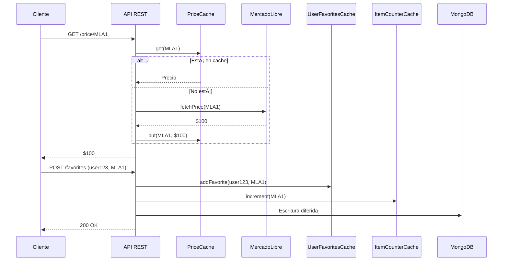

```mermaid
sequenceDiagram
    participant Client as Cliente
    participant API as API REST
    participant PriceCache as PriceCache
    participant ML as MercadoLibre
    participant FavCache as UserFavoritesCache
    participant Counter as ItemCounterCache
    participant Mongo as MongoDB

    Client->>API: GET /price/MLA1
    API->>PriceCache: get(MLA1)
    alt Está en cache
        PriceCache-->>API: Precio
    else No está
        API->>ML: fetchPrice(MLA1)
        ML-->>API: $100
        API->>PriceCache: put(MLA1, $100)
    end
    API-->>Client: $100

    Client->>API: POST /favorites (user123, MLA1)
    API->>FavCache: addFavorite(user123, MLA1)
    API->>Counter: increment(MLA1)
    API->>Mongo: Escritura diferida
    API-->>Client: 200 OK
```
