# Coupon API para Mercado Libre

## Descripción General

API REST diseñada para Mercado Libre que resuelve tres desafíos principales:
1. Cálculo óptimo de items para cupones de compra
2. Gestión y estadísticas de items favoritos
3. Arquitectura escalable para alto tráfico (hasta 100K RPM)

**🔗 URL de Producción**: [https://challengemeli-t3rt.onrender.com](https://challengemeli-t3rt.onrender.com)  
**📚 Documentación Swagger**: [https://challengemeli-t3rt.onrender.com/swagger-ui/index.html](https://challengemeli-t3rt.onrender.com/swagger-ui/index.html)

## Tecnologías Principales

| Tecnología       | Uso                                                                 |
|------------------|---------------------------------------------------------------------|
| Java 21          | Lenguaje base del proyecto                                          |
| Spring Boot 3.4.7| Framework principal para la API REST                                |
| MongoDB          | Almacenamiento de items favoritos y estadísticas                   |
| Caffeine         | Sistema de caching en memoria para mejorar rendimiento             |
| Resilience4j     | Implementación de Circuit Breaker para llamadas externas           |
| WebClient        | Cliente HTTP reactivo para consumir API de MercadoLibre            |
| SpringDoc        | Generación automática de documentación OpenAPI/Swagger             |

## Patrones de Diseño Implementados

### 1. Arquitectura Hexagonal

### 1. Diagrama de  Secuencia

```mermaid
sequenceDiagram
    participant Cliente
    participant CouponController
    participant CouponService
    participant PriceClient
    participant CachePrecios
    participant APIMeli
    participant StatsController
    participant FavoriteService
    participant FavoriteRepository
    participant CacheTop5
    participant UserFavoriteService
    participant UserFavoriteRepository
    participant CacheUserFavs
    participant MongoDB

    %% Flujo para el cupón (Nivel 1) - Con cache de precios
    Cliente->>CouponController: POST /coupon {item_ids, amount}
    CouponController->>CouponService: calculateBestItems(item_ids, amount)
    
    loop Para cada item_id
        CouponService->>PriceClient: getPrice(item_id)
        PriceClient->>CachePrecios: getIfPresent(item_id)
        alt Precio en cache
            CachePrecios-->>PriceClient: precio
        else No en cache
            PriceClient->>APIMeli: GET /items/{id}
            APIMeli-->>PriceClient: precio
            PriceClient->>CachePrecios: put(item_id, precio)
        end
        PriceClient-->>CouponService: Item(item_id, precio)
    end
    
    CouponService->>CouponService: Ejecuta algoritmo de optimización
    CouponService-->>CouponController: CouponResult
    CouponController-->>Cliente: {item_ids, total}

    %% Flujo para estadísticas (Nivel 2) - Cache Top5
    Cliente->>StatsController: GET /coupon/stats
    StatsController->>FavoriteService: getTop5Favorites()
    FavoriteService->>CacheTop5: get("top5")
    alt Existe en cache
        CacheTop5-->>FavoriteService: top5
    else No existe
        FavoriteService->>FavoriteRepository: findTop5Favorites()
        FavoriteRepository->>MongoDB: Query (sort, limit 5)
        MongoDB-->>FavoriteRepository: Documentos
        FavoriteRepository-->>FavoriteService: List<ItemFavoriteStats>
        FavoriteService->>CacheTop5: put("top5", resultados)
    end
    FavoriteService-->>StatsController: top5
    StatsController-->>Cliente: List<ItemFavoriteStats>

    %% Flujo para agregar favorito - Con caches
    Cliente->>StatsController: POST /coupon/user/favorite {user_id, item_id}
    StatsController->>UserFavoriteService: addFavorite(user_id, item_id)
    
    %% Actualización en MongoDB
    UserFavoriteService->>UserFavoriteRepository: addFavoriteByUser(user_id, item_id)
    UserFavoriteRepository->>MongoDB: insert(UserItemFavoriteDocument)
    
    %% Actualización de caches afectados
    UserFavoriteRepository->>CacheUserFavs: getIfPresent(user_id)
    alt Usuario en cache
        UserFavoriteRepository->>CacheUserFavs: put(user_id, nuevosFavoritos)
    end
    
    %% Invalidación cache Top5
    UserFavoriteService->>FavoriteRepository: incrementFavoriteCount(item_id)
    FavoriteRepository->>MongoDB: update (inc favoriteCount)
    FavoriteService->>CacheTop5: invalidate("top5")
    
    StatsController-->>Cliente: 200 OK
```

